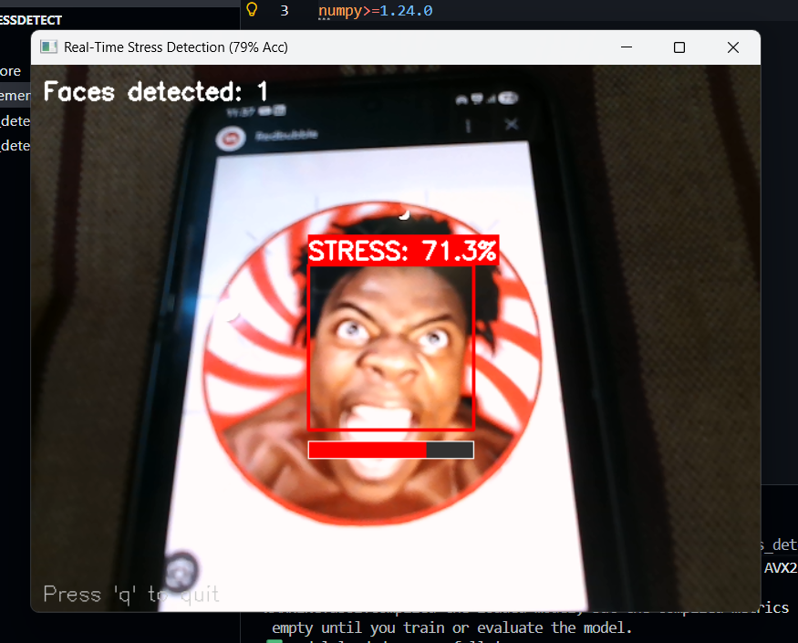
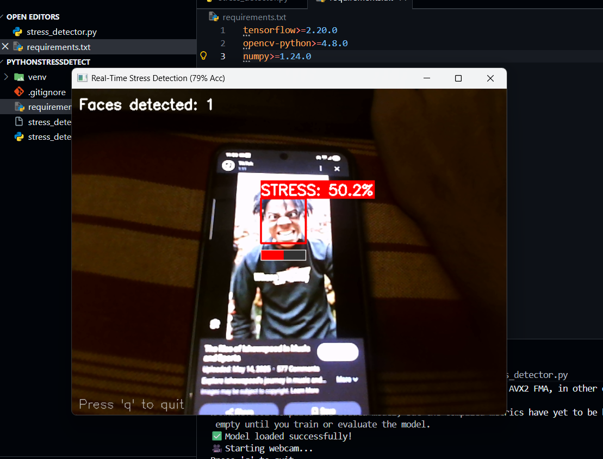
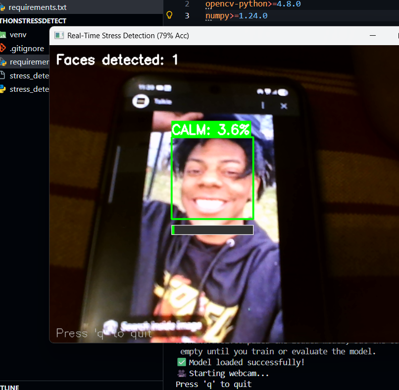

# Real-Time Facial Stress Detection System 🧠😰

An AI-powered application that detects stress levels through real-time facial expression analysis using deep learning. The system leverages a Convolutional Neural Network (CNN) trained on the FER2013 dataset to provide instant stress detection feedback with visual indicators.


## 📋 Table of Contents

- [Overview](#overview)
- [Features](#features)
- [Demo](#demo)
- [Dataset](#dataset)
- [Model Architecture](#model-architecture)
- [Installation](#installation)
- [Usage](#usage)
- [Project Structure](#project-structure)
- [Performance Metrics](#performance-metrics)
- [Troubleshooting](#troubleshooting)
- [Future Enhancements](#future-enhancements)
- [Contributing](#contributing)
- [License](#license)

## 🎯 Overview

The Real-Time Facial Stress Detection System is an intelligent application designed to monitor stress levels through facial expression analysis. Using computer vision and deep learning, the system processes live video feeds, detects faces, analyzes facial features, and provides instant feedback with color-coded visual indicators showing the probability of stress detection.

**Key Highlights:**
- ✅ Real-time stress detection from webcam feed
- ✅ Binary classification: Stress vs. No-Stress
- ✅ 79% validation accuracy with 0.88 AUC
- ✅ Temporal smoothing for stable predictions
- ✅ Privacy-focused offline processing
- ✅ Suitable for mental health monitoring and workplace wellness

## ✨ Features

- **Real-Time Processing**: Analyzes facial expressions frame-by-frame with minimal latency
- **Visual Feedback**: Color-coded bounding boxes (red for stress, green for calm) with confidence scores
- **Temporal Smoothing**: Moving average over 10 frames for stable and reliable predictions
- **Offline Operation**: All processing happens locally, ensuring complete privacy
- **Easy Setup**: Simple installation with minimal dependencies
- **Robust Detection**: Uses Haar Cascade for efficient face detection

## 🎬 Demo

### System in Action

**Stress Detection (71.3%)**



*The system detects high stress levels with a red bounding box and confidence score of 71.3%*

---

**Stress Detection (50.2%)**



*Marginal stress detection at 50.2% threshold with red indicator*

---

**Calm State Detection (3.6%)**



*The system identifies a calm state with a green bounding box, showing only 3.6% stress probability*

---

The application displays:
- Number of faces detected in the frame
- Real-time stress percentage
- Visual progress bar indicating confidence level
- Color-coded bounding box (Red = Stress, Green = Calm)

## 📊 Dataset

The project utilizes the **FER2013 (Facial Expression Recognition 2013)** dataset, a widely recognized benchmark for facial expression recognition tasks.

**Dataset Specifications:**
- **Total Images**: 35,887 grayscale images
- **Image Size**: 48×48 pixels
- **Original Classes**: 7 emotions (angry, disgust, fear, happy, sad, surprise, neutral)
- **Binary Mapping**:
  - **Stress (Class 1)**: Angry, Disgust, Fear, Sad (46.5%)
  - **No-Stress (Class 0)**: Happy, Surprise, Neutral (53.5%)

**Data Split:**
- Training Set: 28,709 images (80%)
- Validation/Test Set: 7,178 images (20%)
- Stratified sampling to maintain class distribution

**Acquisition:**
The dataset was downloaded from Kaggle using the `kagglehub` library, providing programmatic access to ensure reproducibility.

## 🏗️ Model Architecture

The system employs a Convolutional Neural Network (CNN) specifically designed for grayscale facial expression classification.

**Architecture Overview:**

```
Input Layer (48×48×1)
    ↓
Conv Block 1: 32 filters (3×3) → BatchNorm → MaxPool → Dropout(0.3)
    ↓
Conv Block 2: 64 filters (3×3) → BatchNorm → MaxPool → Dropout(0.3)
    ↓
Conv Block 3: 128 filters (3×3) → BatchNorm → MaxPool → Dropout(0.3)
    ↓
Flatten Layer
    ↓
Dense Layer: 128 neurons → BatchNorm → Dropout(0.5)
    ↓
Output Layer: 1 neuron (Sigmoid activation)
```

**Key Features:**
- **Activation**: ReLU activation functions for non-linearity
- **Initialization**: He uniform weight initialization
- **Regularization**: Batch normalization and dropout layers to prevent overfitting
- **Loss Function**: Binary crossentropy
- **Optimizer**: Adam optimizer with initial learning rate of 0.001
- **Learning Rate Scheduling**: ReduceLROnPlateau (factor=0.5, patience=3)

## 🚀 Installation

### Prerequisites

- Python 3.8 or higher
- Webcam (for real-time detection)
- Windows, macOS, or Linux

### Step-by-Step Setup

1. **Clone the Repository**
```bash
git clone https://github.com/yourusername/stress-detection-system.git
cd stress-detection-system
```

2. **Create Virtual Environment** (Recommended)

**Windows:**
```bash
python -m venv venv
venv\Scripts\activate
```

**macOS/Linux:**
```bash
python3 -m venv venv
source venv/bin/activate
```

3. **Install Dependencies**
```bash
pip install -r requirements.txt
```

**requirements.txt:**
```
tensorflow>=2.20.0
opencv-python>=4.8.0
numpy>=1.24.0
```

4. **Download the Trained Model**

Download `stress_detection_model.h5` from the [Releases](https://github.com/yourusername/stress-detection-system/releases) page and place it in the project root directory.

## 💻 Usage

### Running the Application

1. **Ensure your webcam is connected** and accessible

2. **Activate the virtual environment** (if not already active)

3. **Run the stress detector**
```bash
python stress_detector.py
```

4. **Interact with the application:**
   - The webcam feed will open in a new window
   - Face detection and stress analysis happen automatically
   - Press **'q'** to quit the application

### Command Line Options

```bash
# Use default model path
python stress_detector.py

# Specify custom model path
python stress_detector.py --model_path /path/to/your/model.h5
```

### Understanding the Output

- **Green Bounding Box**: Calm state (stress probability < 50%)
- **Red Bounding Box**: Stress detected (stress probability ≥ 50%)
- **Percentage**: Real-time confidence score
- **Progress Bar**: Visual representation of stress level
- **Faces Detected**: Number of faces in the current frame

## 📁 Project Structure

```
stress-detection-system/
│
├── stress_detector.py          # Main application script
├── requirements.txt            # Python dependencies
├── stress_detection_model.h5   # Trained CNN model (download separately)
├── README.md                   # Project documentation
├── .gitignore                  # Git ignore file
├── LICENSE                     # License information
│
├── screenshots/                # Demo images
│   ├── stress_detection_71.png
│   ├── stress_detection_50.png
│   └── calm_detection.png
│
└── venv/                       # Virtual environment (not in repo)
```

## 📈 Performance Metrics

The model was trained using Google Colab with GPU acceleration over 29 epochs.

**Training Results:**
- **Training Accuracy**: 84%
- **Validation Accuracy**: 79%
- **Validation AUC**: 0.88
- **Training Strategy**: 
  - Class weights applied (stress: 1.3, no-stress: 1.0)
  - Early stopping with patience of 7 epochs
  - Learning rate reduction on plateau
  - Final learning rate: 0.000125

**Model Performance:**
- Excellent discrimination capability between stress and no-stress states
- Good generalization without significant overfitting
- Balanced performance across both classes

## 🔧 Troubleshooting

### Common Issues and Solutions

**1. Model File Not Found**
```
Error: stress_detection_model.h5 not found
```
**Solution**: Verify the model file is in the same directory as `stress_detector.py` and the filename matches exactly.

---

**2. Webcam Access Issues**
```
Error: Cannot access webcam
```
**Solution**: 
- Ensure no other application is using the camera
- Check camera permissions in your OS settings
- Try running the script with administrator/sudo privileges

---

**3. Slow Performance**
```
System running slowly or low FPS
```
**Solution**:
- Close resource-intensive applications
- Enable GPU acceleration for TensorFlow (if available)
- Reduce temporal smoothing window from 10 to 5 frames in the code

---

**4. TensorFlow Version Conflicts**
```
Error: Module compatibility issues
```
**Solution**:
```bash
pip install --upgrade tensorflow opencv-python numpy
```

---

**5. Import Errors**
```
Error: No module named 'cv2' or 'tensorflow'
```
**Solution**: Ensure virtual environment is activated and dependencies are installed:
```bash
pip install -r requirements.txt
```

## 🔮 Future Enhancements

- [ ] Multi-class emotion detection (7 emotions)
- [ ] Mobile application development (iOS/Android)
- [ ] Historical stress tracking and analytics dashboard
- [ ] Integration with wearable devices
- [ ] Cloud-based deployment for remote monitoring
- [ ] Multi-face detection and tracking
- [ ] Audio-based stress detection fusion
- [ ] Personalized stress threshold calibration

## 🤝 Contributing

Contributions are welcome! Please follow these steps:

1. Fork the repository
2. Create a feature branch (`git checkout -b feature/AmazingFeature`)
3. Commit your changes (`git commit -m 'Add some AmazingFeature'`)
4. Push to the branch (`git push origin feature/AmazingFeature`)
5. Open a Pull Request

Please ensure your code follows PEP 8 style guidelines and includes appropriate documentation.

## 📄 License

This project is licensed under the MIT License - see the [LICENSE](LICENSE) file for details.

## 🙏 Acknowledgments

- **FER2013 Dataset**: Facial Expression Recognition 2013 dataset from Kaggle
- **TensorFlow**: For providing robust deep learning framework
- **OpenCV**: For efficient computer vision operations
- **Kaggle**: For hosting the FER2013 dataset

## 📧 Contact

For questions, suggestions, or collaboration opportunities:

- **GitHub**: [@yourusername](https://github.com/yourusername)
- **Email**: your.email@example.com
- **LinkedIn**: [Your Name](https://linkedin.com/in/yourprofile)

## ⭐ Star History

If you find this project useful, please consider giving it a star! ⭐

---

**Built with ❤️ for mental health and wellness applications**
